

<h1 id="ajuda-jogador">Tutorial Jogador</h1>
<h2 id="sumario">Sumário</h2>
<ul>
<li><a href="#login">Processo de Login</a></li>
<li><a href="#jogo">Participando de uma disputa</a>
<ul>
<li><a href="#jogando">Jogando</a>
<ul>
<li><a href="#magias">USANDO MAGIAS</a></li>
</ul>
</li>
</ul>
</li>
<li><a href="#duvidas">Dúvidas</a></li>
<li><a href="#nota-importante">Nota Importante</a></li>
</ul>
<h2 id="login">Processo de login</h2>

Ao acessar a página inicial será apresentada para o Jogador uma tela semelhante a que segue abaixo ilustrada:

O Jogador deverá informar o Id do mapa fornecido pelo Professor(a) e clicar em &quot;Acessar &gt;&gt;&quot;. 
•	Se aparecer a mensagem &quot;Mapa Indisponível&quot;, significa que o Professor(a) não liberou o acesso do mapa até o momento. O Jogador deverá aguardar a liberação para tentar novamente.

Após o Rimor App confirmar que o mapa está liberado, o Jogador deverá informar um apelido, “nickname”, e clicar em “Registrar &gt;&gt;”. Trata-se de um apelido único e que o identificará, constituído apenas de letras do alfabeto e números decimais.

Caso algum outro Jogador já tenha se registrado usando o apelido informado, o Rimor App emitirá uma mensagem solicitando que o Jogador informe de outro apelido. Uma vez registrado, será mostrado ao Jogador, na tela, instruções gerais de como jogar.

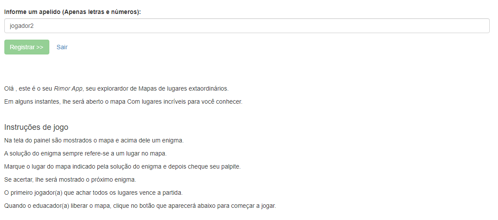

O Jogador deverá aguardar até o Educador(a) liberar o mapa para uma disputa, jogo. Quando o Educador(a) fizer essa liberação, aparecerá o botão &quot;Ir para o meu painel&quot;. O Jogador deverá clicar nesse botão para começar a jogar.

Nota: Caso o Jogador clique em &quot;sair&quot; ao lado do botão “Registrar &gt;&gt;” ou em “sair” na barra de menu, será registrado a desistência do Jogador antes de efetuar a saída do sistema. Para poder participar da disputa novamente, o Jogador, deverá repetir todo processo descrito até o momento nesse documento e registrar-se com outro “nickname”.

<a href="#sumario">Voltar ao Sumário</a>

<h2 id="jogo">Participando de uma disputa</h2>

Após a liberação do mapa para jogo, o Jogador terá acesso ao seu painel como mostra a figura ilustrada a seguir.

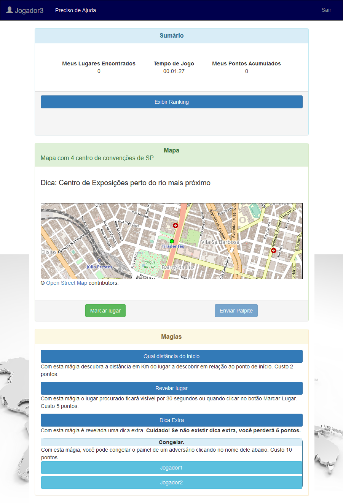

<h3 id="informa%C3%A7%C3%B5es-do-painel">Informações do painel</h3>

O painel é dividido em três seções: Sumário, Mapa e Magias.

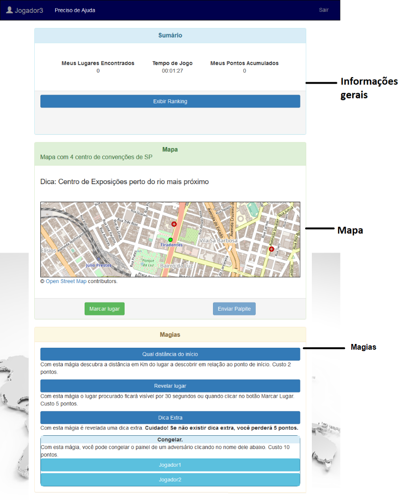

No topo, está a barra de navegação onde o Jogador poderá sair do jogo ou acessar a documentação de ajuda. Essa barra no canto superior esquerdo contém o apelido cadastrado pelo Jogador durante seu acesso ao mapa.

Nota: Caso o Jogador clique em &quot;Sair&quot; antes de finalizar o jogo, será registrado que ele desistiu do jogo.

No sumário são exibidas as seguintes informações:

•	A quantidade de lugares que o Jogador encontrou; 
•	O total de pontos acumulados até o momento; 
•	O tempo que o Jogador está jogando no formato HH:MM:SS; 
•	A posição do Jogador em relação aos adversários (ranking). Essa informação é exibida ou ocultada da tela quando o Jogador clica em “Exibir Ranking”.

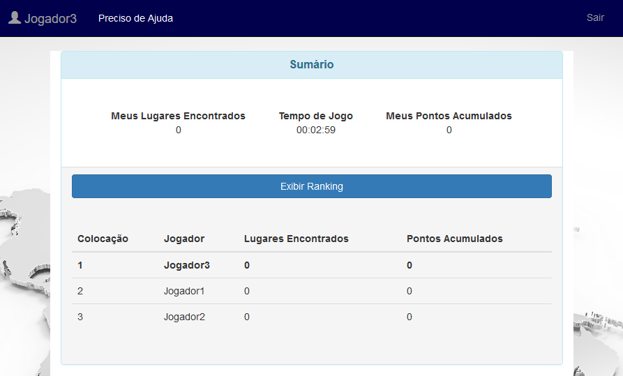

Nota: Durante uma disputa, conforme o Jogador perde posição no ranking, ele será informado. Estas notificações aparecem abaixo da tabela de ranking. A cada 10 notificações, aparecerá um botão para o Jogador limpar essas mensagens.

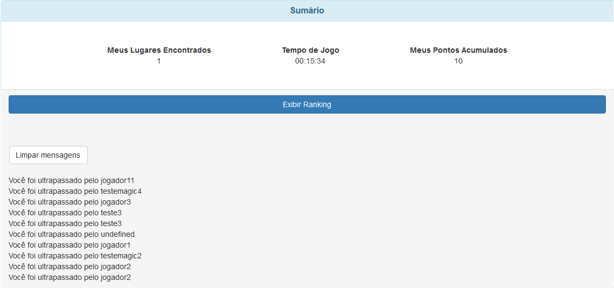

Conforme as mensagens são exibidas, as outras seções do painel são empurradas para baixo.

Na seção mapa, as informações estão dispostas conforme a figura ilustrada a seguir:

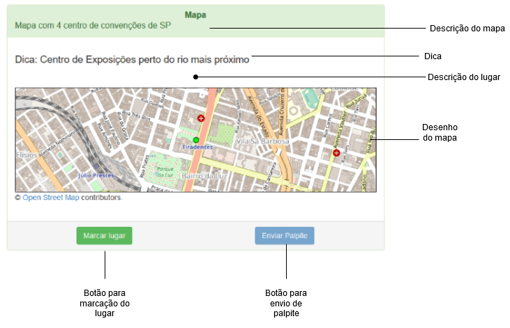

Na seção Magias, estão botões com as magias que os Jogadores poderão usar durante o decorrer da disputa.

<h3 id="jogando">Jogando</h3>

<strong>Objetivo Geral</strong>

Encontrar todos os lugares do mapa acumulando maior quantidade de pontos possível e no menor tempo possível.

<strong>Jogando</strong>

O Jogador ao acessar o seu painel, o desenho do mapa será exibido com uma marcação ou círculo verde ao centro. Esse ponto constitui a marcação do lugar de início. O mapa inicialmente será exibido dessa maneira para todos os Jogadores, indicando que todos começarão do mesmo lugar.

Através da dica, enigma, exibida acima do desenho do mapa, o Jogador deverá tentar localizar o lugar indicado por ela navegando pelo mapa.

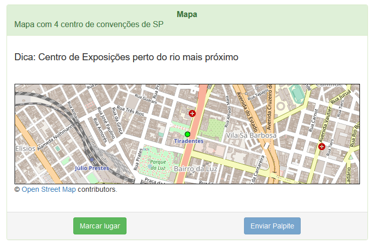

A navegação pelo mapa é feita de 2 formas dependendo do dispositivo que está sendo usado:
•	Clicando, mantendo pressionado e movendo o ponteiro do mouse em uma direção;
•	Pelo toque, tentando mover o mapa com o dedo.

A navegação é semelhante a navegação feita no Google Maps.

Quando o Jogador acreditar que achou o lugar indicado pelo enigma, ele deverá fazer o seguinte:

<ol>
<li>Clicar no botão &quot;Marcar Lugar&quot;;</li>
<li>Clicar em cima do lugar encontrado. Para dispositivos móveis, ele deverá tocar duas vezes consecutivas no lugar;</li>
<li>Clicar no botão &quot;Enviar palpite&quot;.</li>
</ol>

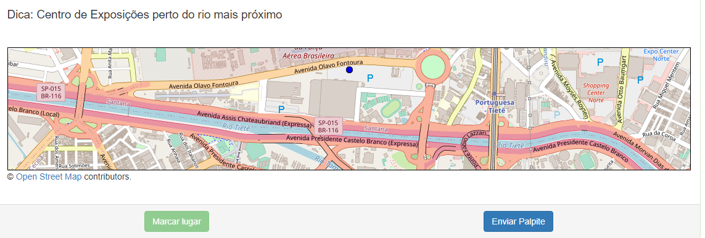

Caso seja o lugar errado, aparecerá a mensagem &quot;Ops! Não foi desta vez!&quot;. Então o Jogador deverá tentar achar o lugar certo novamente.
Caso ele tenha achado o lugar certo, será exibido uma mensagem com informações interessantes do lugar.

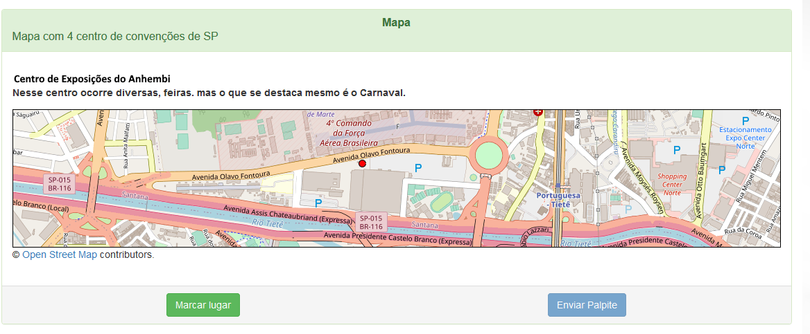

Após achar o lugar certo, poderá ocorrer uma das seguintes situações:

<h5 id="1-o-lugar-encontrado-era-o-%C3%BAltimo-lugar-a-ser-descoberto">1. O lugar encontrado era o último lugar a ser descoberto.</h5>

Nesse caso, o Jogador terá finalizado o jogo. Não poderá marcar mais lugares no mapa e nem usar magias. É registrado que ele finalizou o jogo no cadastro do mapa.

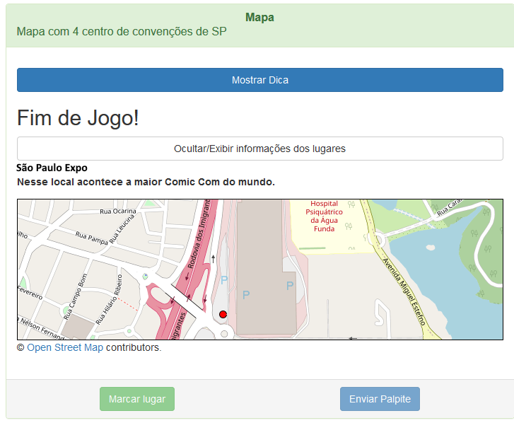

Notas: Agora, caso o Jogador clique em sair, não será registrado no cadastro como desistente.

<h5 id="2-existe-mais-lugares-a-serem-descobertos">2. Existe mais lugares a serem descobertos</h5>

Passados 30 segundos, aproximadamente, após o envio do palpite, aparecerá um botão para exibir a próxima dica assim que ele for clicado.

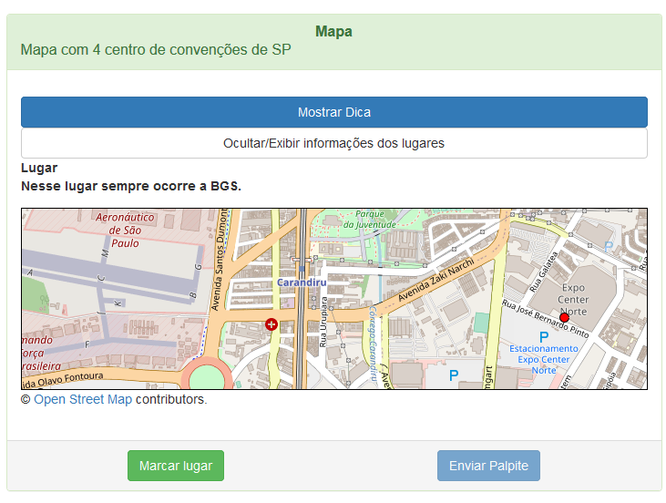

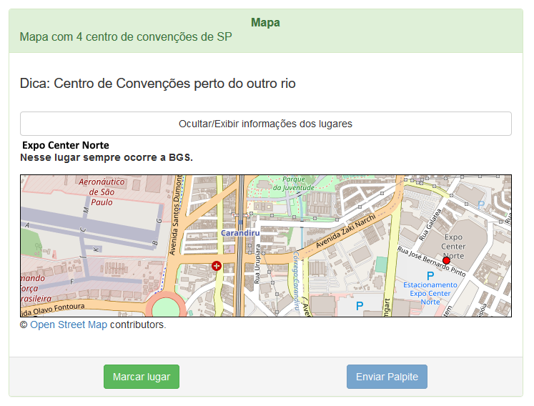

Em ambas as situações, o total de pontos e o total de lugares encontrados pelo Jogador serão atualizados.

<h4 id="magias">USANDO MAGIAS</h4>

Durante uma disputa o Jogador poderá usar magias para obter vantagens em relação aos seus adversários em troca de uma determinada quantidade de pontos conforme o quadro abaixo:

<table>
<thead>
<tr>
<th>Magia</th>
<th>Custo</th>
</tr>
</thead>
<tbody>
<tr>
<td>Exibir distância aproximada do lugar a ser descoberto do lugar de início, linha reta entre os lugares, durante 30 segundos.</td>
<td class="celula-estilo1">  2 pontos.</td>
</tr>
<tr>
<td>Revelar lugar a descobrir durante 30 segundos.</td>
<td class="celula-estilo1">  5 pontos.</td>
</tr>
<tr>
<td>Dica extra para descobrir o lugar.</td>
<td class="celula-estilo1">  5 pontos.</td>
</tr>
<tr>
<td>Impedir que algum adversário use os recursos do jogo durante 30 segundos.</td>
<td class="celula-estilo1">  10 pontos.</td>
</tr>
</tbody>
</table>

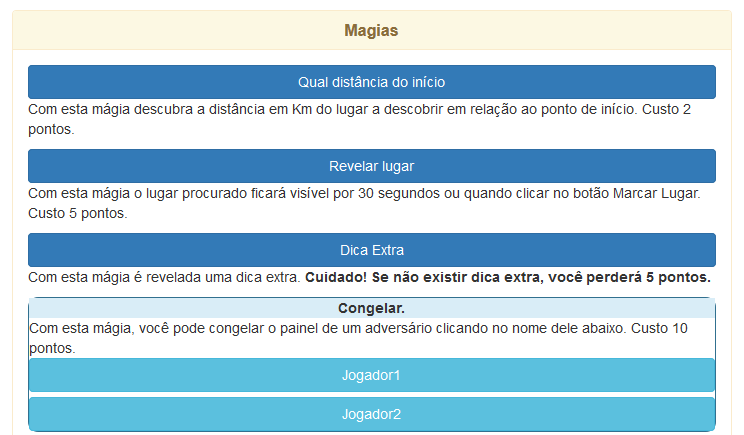

Para poder usar as magias, o Jogador deverá clicar no botão correspondente à magia que ele quer usar.

<strong>Distância em relação ao lugar de início</strong>

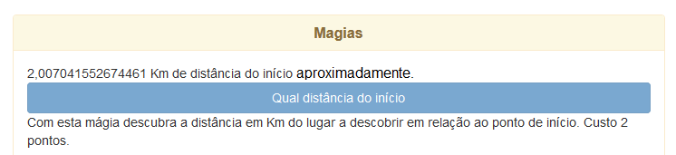

<strong>Revelar lugar a descobrir temporariamente</strong>

<strong>Obter dica extra</strong>

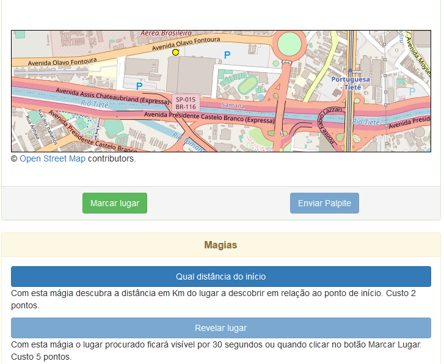

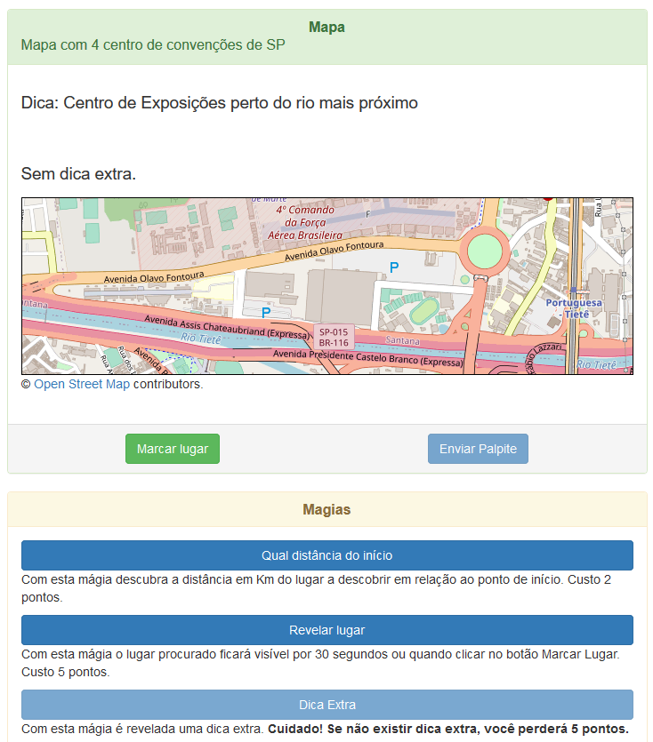

Nota: O Jogador deverá ser cauteloso ao usar essa magia, pois serão subtraídos os 5 pontos mesmo que o Educador não tenha disponibilizado uma dica extra para o lugar a ser descoberto.

<strong>Congelar painel de adversário</strong>

Para usar essa magia, o Jogador deverá clicar no nome do adversário que deseja congelar o painel. Caso nenhum outro Jogador tenha utilizado essa magia no adversário desejado, ela poderá ser aplicada no adversário e durante 30 segundos ele não conseguirá usar seu painel.

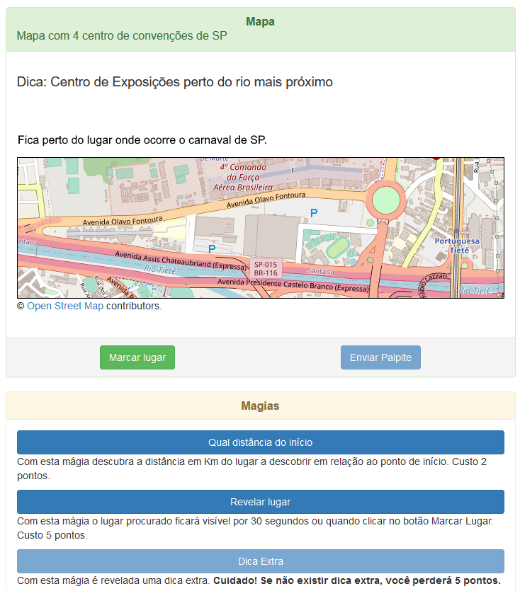

Observação

Todas as magias só poderão ser usadas uma vez por turno. Um turno é uma tentativa de localizar um lugar no mapa. Para que o Jogador possa utilizar a mesma magia mais de uma vez, ele precisará descobrir mais lugares do mapa.

<a href="#sumario">Voltar ao Sumário</a>

<h2 id="duvidas">Dúvidas</h2>
<h3 id="o-que-%C3%A9-%22open-street-map%22">O que é &quot;Open Street Map&quot;</h3>

Abaixo do desenho do mapa aparece a frase “Open Street Maps contributors”. A &quot;Open Street Map&quot; é uma instituição, Fundação OpenStreetMap (OSMF), que disponibiliza de forma aberta dados geográficos.
Sem essa instituição e seus contribuintes, não seria possível criar o Rimor App.

<a href="#sumario">Voltar ao Sumário</a>

<h2 id="nota-importante">Nota Importante</h2>

Como as telas do jogo se adaptam ao tamanho da tela, as disposições dos elementos mostrado nas imagens contidas nesse documento podem variar.

<a href="#sumario">Voltar ao Sumário</a>

