
    
<h1 id="ajuda-professor">Tutorial Professor</h1>
<h2 id="sumario">Sumário</h2>
<ul>
<li><a href="#login">Login</a></li>
<li><a href="#altsenha">Alterando Senha</a></li>
<li><a href="#cadedu">CRIAR USUÁRIO NO RIMOR APP</a></li>
<li><a href="#meusmapas">Meus Mapas</a></li>
<li><a href="#novo-mapa">Criando Mapas</a>
<ul>
<li><a href="#cad-mapa_pesq">Usando a ferramenta de pesquisa</a></li>
</ul>
</li>
<li><a href="#ger-mapa">Gerenciando Mapa</a></li>
<li><a href="#magias_jogador"> MAGIAS PARA USO DO JOGADOR</a></li>
<li><a href="#fluxo-jogador">Fluxo de Acesso do Jogador a uma disputa</a></li>
<li><a href="#duvidas">Dúvidas</a></li>
<li><a href="#nota-importante">Nota Importante</a></li>
</ul>
<h2 id="login">Processo de login</h2>

Ao acessar a página inicial será apresentada para o Educador uma tela semelhante a da figura ilustrada abaixo. Nela, o Educador deverá clicar em &quot;Educador, clique aqui para fazer o login&quot;.

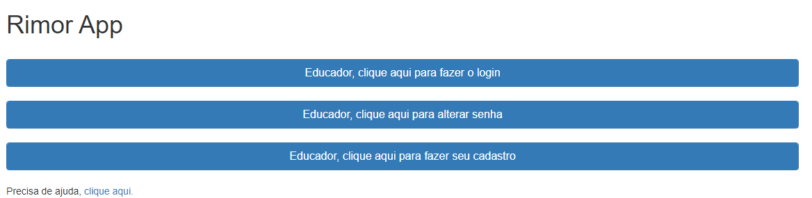

O Educador deverá informar usuário e senha e clicar em &quot;Entrar &gt;&gt;&quot;.

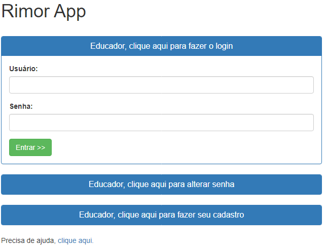

Caso apareça a mensagem &quot;Usuário e/ou senha incorretos&quot;, o  Educador terá de alterar sua senha de acesso. Caso o usuário e senha estejam corretos, o Educador será direcionado para uma tela semelhante a da figura ilustrada a seguir:

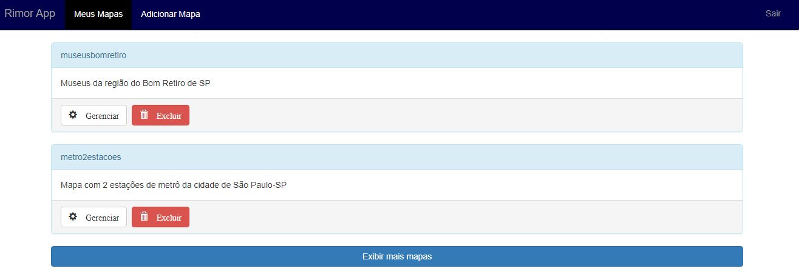

<a href="#sumario">Voltar ao Sumário</a>

<h2 id="altsenha">Alterando Senha</h2>

A partir da página inicial, deve-se clicar em “Educador, clique aqui para alterar senha”, caso deseje alterar sua senha.

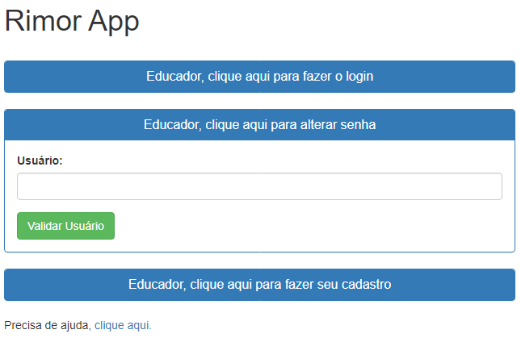

O Educador deverá informar seu usuário, login, e então clicar em “Validar Usuário”.
Caso o sistema confirme a existência do usuário no cadastro, aparecerão mais dois campos, utilizados para digitar a nova senha. Então o Educador deverá informar duas vezes sua nova senha de acesso e clicar em “Cadastrar Nova Senha”.

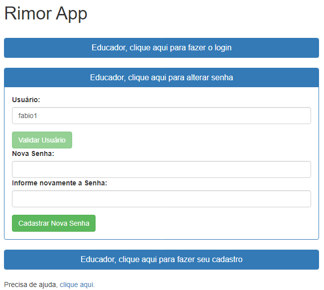

Observação: Caso o sistema não encontre o login informado no campo “Usuário”, ele avisará o Educador.

<a href="#sumario">Voltar ao Sumário</a>

<h2 id="cadedu">CRIAR USUÁRIO NO RIMOR APP</h2>

Na página inicial, o Educador deverá clicar em “Educador, clique aqui para fazer seu cadastro”. Ao fazê-lo, será exibida a tela como a ilustrada na figura abaixo:

O Educador deverá preencher todos os campos, lê e aceitar o termo de responsabilidade de uso e clicar no botão “Cadastrar”.
Caso o usuário informado já exista no cadastro, o sistema avisará ao Educador que ele deverá informar um usuário diferente. Caso o usuário informado não esteja cadastrado, o sistema realiza o cadastro das informações e na sequência alertará o Educador.

Com o usuário e senha cadastrados, o Educador já poderá realizar o login no sistema.

Observações:

•	É necessário que o Educador guarde seu usuário, pois só com ele será possível fazer o login no sistema e alterar sua senha se necessário;
•	O nome e e-mail informados são guardados no cadastro como medida de segurança. Eles só serão compartilhados exclusivamente no caso de ocorrer uma determinação judicial.

<a href="#sumario">Voltar ao Sumário</a>

<h2 id="meusmapas">Meus Mapas</h2>

Assim que o Educador fizer o login, será exibida a tela como a ilustrada na figura abaixo:

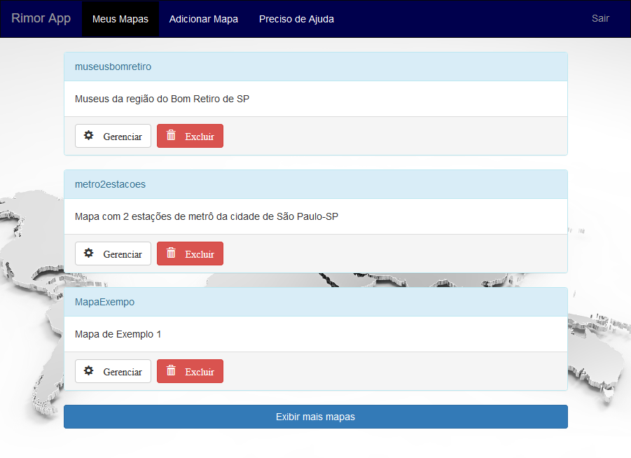

Nessa tela são exibidos os mapas criados pelo Educador.

No topo da tela, está uma barra azul com as opções do sistema. São elas:

Meus Mapas: Mostra a tela exibida na figura acima. Essa opção encontra-se destacada com contorno preto. Exibe os mapas criados pelo Educador.
Adicionar Mapa: Permite criar um mapa.
Sair: Efetua a saída do Rimor App.

Essa barra azul consiste na barra de navegação do Rimor App. No final da página, tem um botão &quot;Exibir mais mapas&quot;. Caso o botão seja clicado, ele irá exibir informações de mais 3 mapas cadastrados, caso existam.

Notas: São sempre exibidos 3 mapas por vez, ao clicar no botão &quot;Exibir mais mapas&quot; ou no carregamento inicial da página. Caso não exista nenhum mapa cadastrado, o Rimor App alertará o Educador.

Na parte central da página ou tela, são mostrados retângulos arredondados com as seguintes informações para cada mapa.

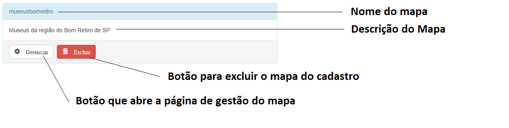

<a href="#sumario">Voltar ao Sumário</a>

<h2 id="novo-mapa">Criando Mapas</h2>
<h3 id="antes-de-come%C3%A7ar">Antes de começar</h3>

Antes de começar o cadastramento do seu novo mapa, é importante que o Educador já tenha as seguintes informações sobre os lugares que deseja cadastrar:

•	Nome do lugar; 
•	Endereço completo (para localizar o lugar na tela com facilidade); 
•	Curiosidades que deseja cadastrar sobre o lugar; 
•	Qual vai ser a dica; 
•	Total de pontos que cada lugar possuirá.

É importante que também que o Educador já tenha definido qual será a ordem que os jogadores deverão percorrer o mapa (roteiro) e qual o lugar inicial (ponto de partida). Além disso, é recomendável que o Educador já tenha definido quais lugares terão uma dica extra.

<h3 id="tela-de-cadastro">Tela de Cadastro</h3>

A tela é dividida em:

<ol>
<li>Instruções iniciais de cadastro de lugar;</li>
<li>Desenho do mapa mundi, onde é possível navegar (trata-se de um mapa parecido com Google Maps);</li>
<li>Botão que permite a marcação de um lugar no mapa;</li>
<li>Botão para confirmar a marcação inserida;</li>
<li>Botão para cancelar a marcação inserida;</li>
<li>Ferramentas para controle de zoom no mapa mundi e mais uma ferramenta de pesquisa para auxiliar na busca de lugares no mapa.</li>
</ol>

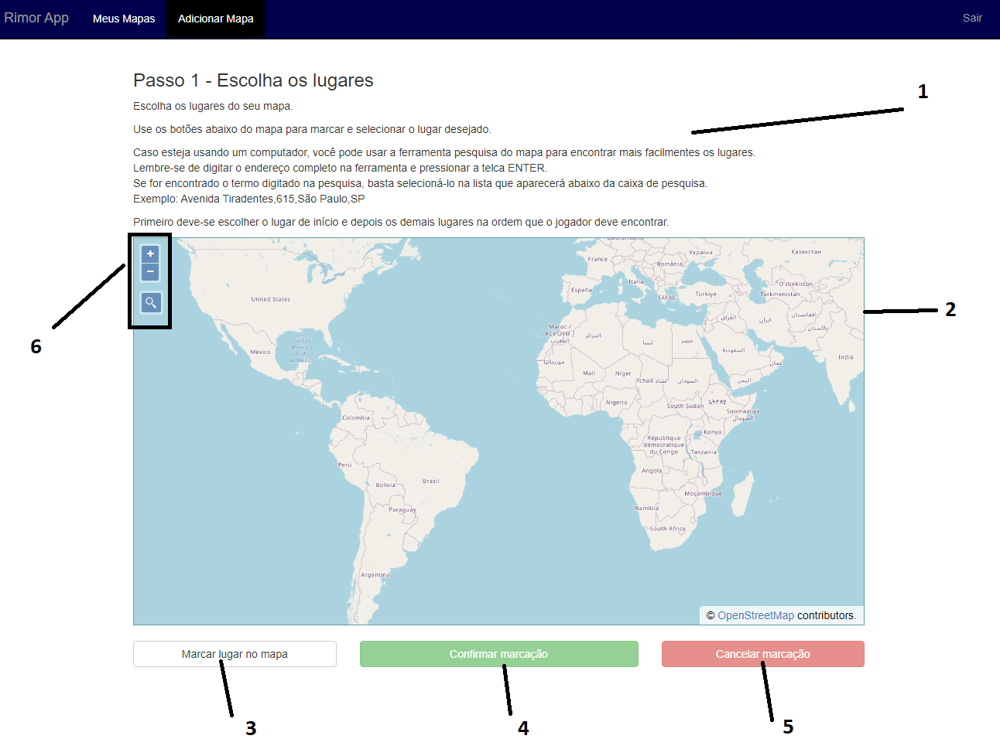

<h3 id="criando-novo-mapa">Criando Novo mapa</h3>

Uma vez que o Educador já tenha levantado todas as informações dos lugares que deseja cadastrar no seu novo mapa, é possível:

<ol>
<li>Navegar e aumentar o zoom no mapa para localizar os lugares desejados;</li>
</ol>

ou

<ol start="2">
<li>Digitar o endereço na ferramenta de pesquisa do mapa. Se localizado, o lugar será exibido. Não recomendado quando o acesso a página está sendo feito por meio de dispositivos com tela pequena como por exemplo smartphones.</li>
</ol>

Observação:
•	Recomenda-se informar o endereço da seguinte forma: nome da rua (avenida, ...), número, cidade, sigla do estado. Exemplo: Avenida Tiradentes,615, São Paulo, SP.

Nota: Pode-se usar o botão de rolagem do mouse para dar zoom ao mapa.

O processo de criação de mapas, é dividido em 2 fases

<ol>
<li>Cadastro de lugares 
a. Cadastro do lugar inicial; 
b. Cadastro dos demais lugares.</li>
<li>Cadastro de informações gerais do mapa.</li>
</ol>

Nota: Um mapa deve ter no mínimo 2 lugares, o marco inicial ou ponto de início e um lugar a descobrir.

<h4 id="passo-1a---escolhendo-lugar-inicial">Passo 1a - Escolhendo lugar inicial</h4>

Por meio da navegação no mapa, o Educador deve localizar o lugar que deseja que seja o lugar inicial e clicar no botão &quot;Marcar Lugar no mapa&quot;.
Um círculo azul aparecerá acompanhando o ponteiro do mouse. Então o Educador deverá levar o círculo até o lugar desejado e clicar no lugar.

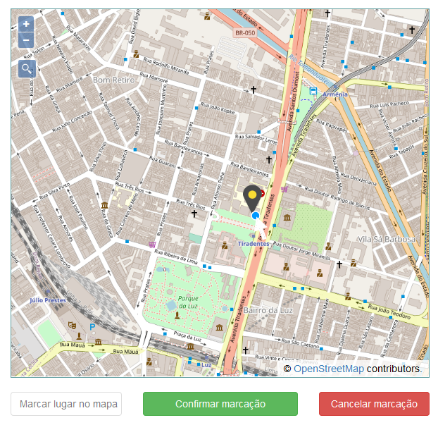

O lugar selecionado ficará da cor vermelha. Então, o Educador poderá clicar no botão &quot;confirmar marcação&quot; caso tenha escolhido corretamente ou então, clicar no botão &quot;cancelar marcação&quot; para desfazer sua marcação.

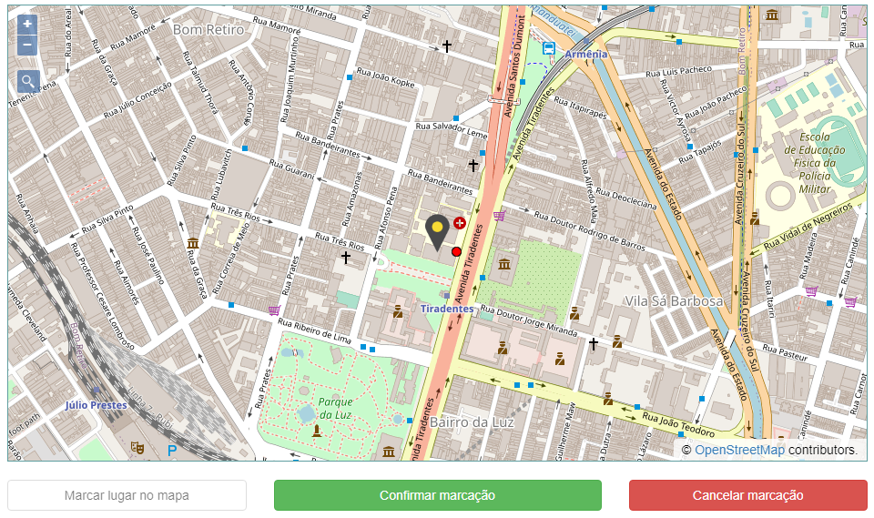

Ao clicar em &quot;confirmar marcação&quot; aparecerá o seguinte formulário abaixo do mapa.

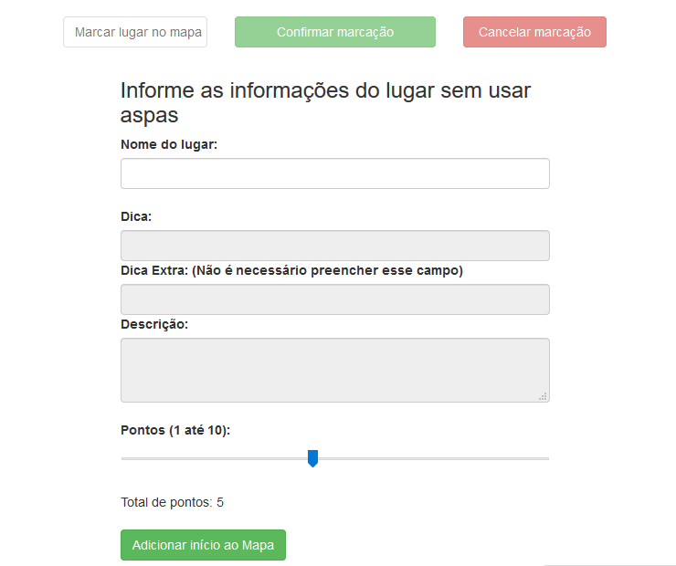

No formulário só é possível informar o nome do lugar, único campo habilitado. Após o nome ter sido informado o Educador já pode clicar no botão &quot;Adicionar início ao mapa&quot;, que fica embaixo do formulário e, assim, seguir para o próximo passo.

<em>Nota: Ao contrário do que indica a imagem acima, o lugar inicial do mapa não atribui pontos ao Jogador, ou seja, todo Jogador começa a disputa com zero pontos.</em>

<h4 id="passo-1b---escolhendo-demais-lugares-do-mapa">Passo 1b - Escolhendo demais lugares do mapa.</h4>

O processo de escolha dos demais lugares para serem adicionados ao mapa é semelhante ao processo de escolha do lugar inicial, sendo a única diferença que após a confirmação da marcação, o Educador deverá informar as demais informações sobre o lugar. Todos os campos deverão, obrigatoriamente, ser preenchidos exceto o de dica extra.

Notas

•	A descrição do lugar é exibida ao jogador assim que ele encontra o lugar e ela pode ser preenchida com no máximo 200 caracteres. 
•	É importante o Educador atentar-se a quantidade de pontos atribuídas a um lugar, uma vez que o jogador pode trocar de pontos por algum recurso para obter vantagem durante o jogo.

Quando o mapa possuir mais de um lugar cadastrado, o lugar de início e mais um lugar, aparecerá o botão &quot;Finalizar adição de lugares&quot;. O Educador só deverá clicar nesse botão APENAS quando terminar de adicionar todos os lugares desejados ao mapa.

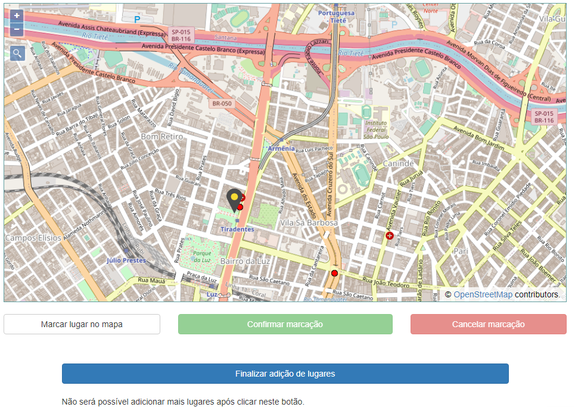

Ao clicar no botão &quot;Finalizar adição de lugares&quot;, o Educador será direcionado para o próximo passo do cadastro. Importante compreender que após clicar nesse botão não será mais possível alterar as informações dos lugares escolhidos ou adicionar mais lugares.

<h4 id="passo-2---demais-informa%C3%A7%C3%B5es-do-mapa">Passo 2 - Demais informações do mapa</h4>

Após finalizar a adição dos lugares ao mapa, será necessário informar um nome único para o mapa no cadastro e uma descrição para o mapa.

Notas

•	A descrição do mapa é exibida para o jogador; 
•	As duas informações são obrigatórias.

Após o Educador clicar em &quot;Cadastrar Mapa&quot;, o botão de cadastro será desabilitado e o mapa recém criado já poderá ser exibido na lista de mapas.

<h4 id="cad-mapa_pesq"> Usando a ferramenta de pesquisa</h4>

Para achar lugares com facilidade, o Educador poderá utilizar a ferramenta de pesquisa do mapa.

O Educador deverá:

<ol>
<li>Clicar no botão de forma de lupa;</li>
<li>Digitar o endereço completo na caixa de texto que aparece e pressionar a tecla “ENTER”;</li>
</ol>

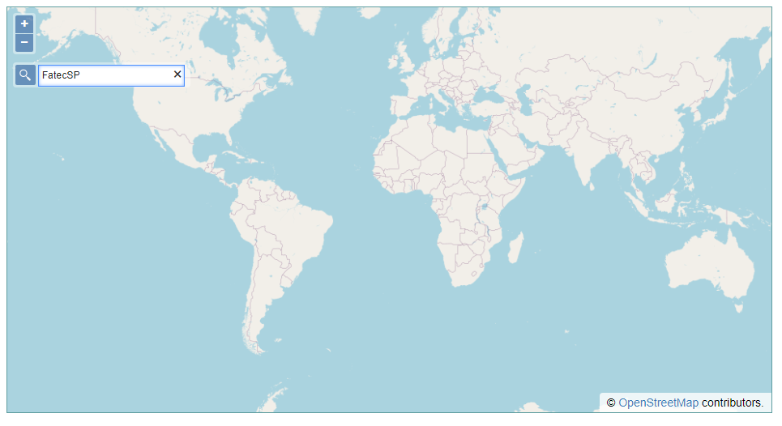

2a. Caso não seja encontrado o endereço, a tela permanecerá sem alterações;

2b. Caso seja encontrado o endereço, no caso, um ou mais de um lugar será mostrado em uma lista. O Educador precisará clicar no item da lista para selecioná-lo. Após o clique o lugar será exibido no mapa.

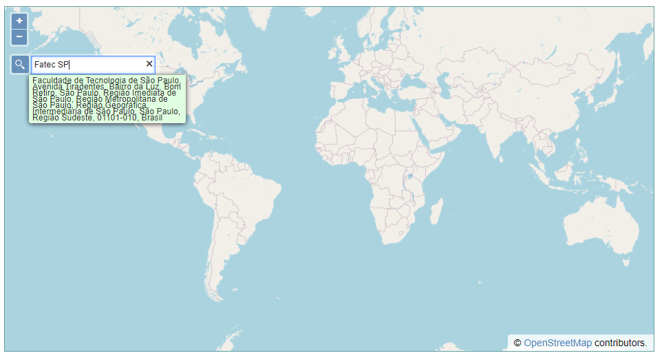
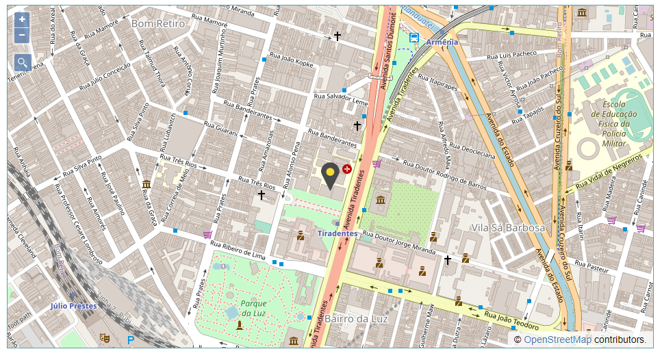

Nota

Apesar do lugar pesquisado aparecer com um símbolo no mapa com uma marcação no formato de uma gota, para adicionar o lugar ao mapa que está sendo criado é necessário marcá-lo pelo botão &quot;Marcar Lugar no Mapa&quot;.

<a href="#sumario">Voltar ao Sumário</a>

<h2 id="ger-mapa">Gerenciando Mapa</h2>

Para gerenciar um mapa, o Educador deverá fazer o login para acessar a página &quot;Meus Mapas&quot; e clicar no botão “Gerenciar” do mapa desejado.

Será apresentada uma tela semelhante ao da figura ilustrada a seguir, onde:

<ol>
<li>Painel de informações gerais do mapa, nome e “id” do mapa;</li>
<li>Painel para controle de acesso dos jogadores ao mapa;</li>
<li>Desenho do mapa mundi com a marcação dos lugares que compõem a rota do mapa. Essa parte da página funciona semelhante ao Google Maps é exibida inicialmente com o lugar que representa o ponto de partida centralizado no desenho. Pode-se navegar pelo mapa com o clicar e arrastar do mouse;</li>
<li>Tabela com os jogadores que estão jogando ou jogaram uma partida.</li>
<li>Tabela de lugares pertencentes ao mapa.</li>
</ol>

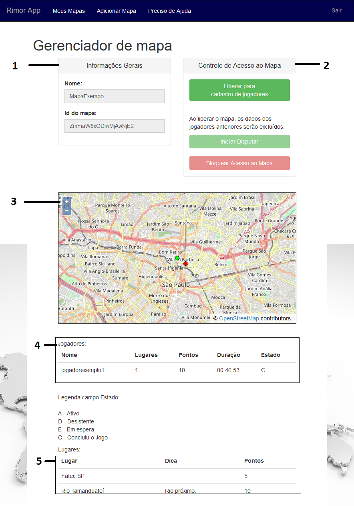

<h3 id="habilitando-mapa-para-uma-disputa">HABILITANDO MAPA PARA UMA DISPUTA</h3>

Após acessar a tela de gerenciamento do mapa, o Educador deverá dirigir sua atenção ao painel de controle de acesso do mapa.

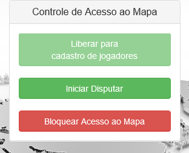

Neste painel, será preciso considerar

<table>
<tr>
<th class="estilo1">Configuração 1</th>
<th class="estilo1">Configuração 2</th>
<th class="estilo1">Configuração 3</th>
</tr>
<tr>
<td class="estilo1">Mapa inacessível para os jogadores.</td>
<td class="estilo1">Mapa com acesso liberado para os jogadores informarem seus apelidos, “nicknames”.</td>
<td class="estilo1">Mapa sendo usado por para disputa pelos jogadores que informaram apelidos anteriormente.</td>
</tr>
<tr>
<td class="estilo1">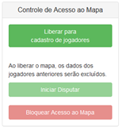</td>
<td class="estilo1"></td>
<td class="estilo1">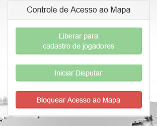</td>
</tr>
</table>

Ao acessar a tela de gerenciamento de um mapa, o painel de controle de acesso do mapa será exibido em uma das três configurações mostradas anteriormente.

<u>Fluxo de liberação do mapa padrão</u>

Considerando que um mapa acabou de ser criado, ao abri-lo, no painel de controle de acesso será mostrada a configuração 1, ao clicar no botão “liberar para cadastro de jogadores” e o painel passará para configuração 2. Conforme os jogadores vão cadastrando seus apelidos, os apelidos serão exibidos na tabela de jogadores. Quando todos os jogadores estiverem cadastrados, o professor pode clicar em “Iniciar disputa” para que o jogo comece. A partir desse momento nenhum outro jogador pode informar um apelido para poder participar do jogo.

Observações:

Ao clicar no botão “Bloquear Acesso ao Mapa”, irá ocorrer uma das situações descritas abaixo:

<ol>
<li>Caso uma partida esteja em andamento, ela será encerrada.</li>
<li>Caso o mapa esteja acessível aos jogadores, ele não estará mais acessível e os jogadores já com apelidos cadastrados não poderão mais acessá-lo até o momento do professor(a) liberar o mapa para cadastro de apelidos novamente. Nesta situação todos os dados dos jogadores da partida anteriormente realizada usando-se o mapa serão excluídos do sistema.</li>
</ol>

Demora alguns segundos para que a opção de liberação do mapa fique disponível novamente.

<h2 id="magias_jogador"> MAGIAS PARA USO DO JOGADOR</h2>

Magias são recursos que o Rimor App oferece aos jogadores com a finalidade deles obterem algumas vantagens ao custo de uma quantidade de pontos específica em troca. 
O quadro a seguir mostra quais benefícios o jogador pode obter durante uma disputa e seus custos em pontos.

<table>
<thead>
<tr>
<th>Magia</th>
<th>Custo</th>
</tr>
</thead>
<tbody>
<tr>
<td>Obter distância em relação ao lugar inicial.</td>
<td>2 pontos</td>
</tr>
<tr>
<td>Revelar lugar a descobrir durante 30 segundos.</td>
<td>5 pontos</td>
</tr>
<tr>
<td>Dica extra para descobrir o lugar.</td>
<td>5 pontos</td>
</tr>
<tr>
<td>Impedir que algum adversário use os recursos do jogo durante 30 segundos.</td>
<td>10 pontos.</td>
</tr>
</tbody>
</table>

<a href="#sumario">Voltar ao Sumário</a>

<h2 id="fluxo-jogador">Fluxo de Acesso do Jogador a uma disputa</h2>

Tela de login o Jogador informará o “Id” do mapa fornecido pelo Educador.

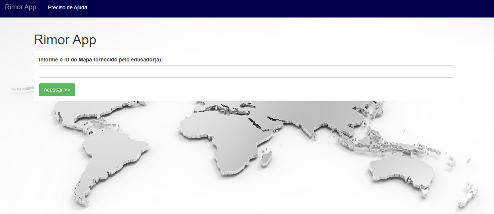

Após informar o “Id” do mapa e clicar no botão “Acessar &gt;&gt;”,  o sistema irá verificar  se o mapa está disponível para acesso, em caso afirmativo, o Jogador deverá informar um apelido único que o identificará e na sequência clicar em &quot;Registrar &gt;&gt;&quot;.

Então um texto com instruções será exibido na tela após o Jogador informar apelido um único.

Após o Educador clicar no botão que inicializará a partida, será mostrado para o Jogador o botão “Ir para o meu painel”.

Ao clicar nesse botão, será mostrado para jogador uma tela semelhante ao da figura ilustrada a seguir:

Caso o Educador(a) decida bloquear o mapa, a única opção do jogador será sair do sistema.

<a href="#sumario">Voltar ao Sumário</a>

<h2 id="duvidas">Dúvidas</h2>
<h3 id="onde-pode-se-obter-o-id-do-mapa">Onde pode-se obter o Id do mapa</h3>

Após fazer o login, na página &quot;Meus Mapas&quot;, o Educador deverá clicar no botão gerenciar do mapa desejado e aguardar o carregamento das informações. No campo &quot;Id do mapa&quot; na parte superior da página encontra-se essa informação.

<h3 id="o-que-%C3%A9-%22open-street-map%22">O que é &quot;Open Street Map&quot;</h3>

A &quot;Open Street Map&quot; é uma instituição, Fundação OpenStreetMap (OSMF) que disponibiliza de forma aberta dados geográficos. Para o uso desses dados é necessário que lhe atribua a devida autoria, por isso nos desenhos mapas aparecem o texto &quot;Open Street Map contributors.&quot; Para mais informações sobre isso <a href="https://www.openstreetmap.org/copyright" target="_blank">clique aqui</a>.

<a href="#sumario">Voltar ao Sumário</a>

<h2 id="nota-importante">Nota Importante</h2>

Como as telas do jogo se adaptam ao tamanho da tela, as disposições dos elementos mostrado nas imagens contidas nesse documento podem variar.

<a href="#sumario">Voltar ao Sumário</a>

